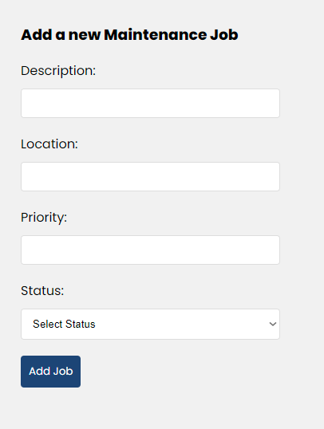

# Job Maintenance Program

This is a full-stack web application built for maintenance management. It allows users to create, archive, update, and batch update maintenance jobs. The application follows the MERN stack architecture.

## Live Application
NOTE: Due to the backend being hosted on Render Free Tier, the server takes 50 seconds start after initial load, thereafter requests should be almost instant. 

So after clicking the link, please wait 50 seconds for backend to start.
[Job Maintenance Program](https://fascinating-concha-b3f0a4.netlify.app)

## Features

- Submit a job that needs doing, including its description, location, priority and status.
- List all jobs, ordered by status and date submitted.
- Update information about a single job.
- Update status of multiple jobs at once (batch update).
- Archive a specific job.
- Filter jobs by job status.

## Setup Instructions

### Backend

1. Install dependencies by running the following command in backend directory: `npm install`
2. Start the backend server in development mode using the following command: `npm run dev`
This will start the server using Nodemon, which automatically restarts the server when changes are made.

### Frontend

1. Install dependencies by running the following command in the frontend directory: `npm install`
2. Start the frontend development server using the following command: `npm start`

## Usage

1. Open your web browser and navigate to the URL where the frontend server is running (`http://localhost:3000`).

2. Use the application interface to perform the desired actions, such as submitting, updating, or archiving jobs.

## Screenshots

*Screenshot 1: Job creation form*

*Screenshot 2: Job update form*

*Screenshot 3: Job list*

*Screenshot 4: Full app*
